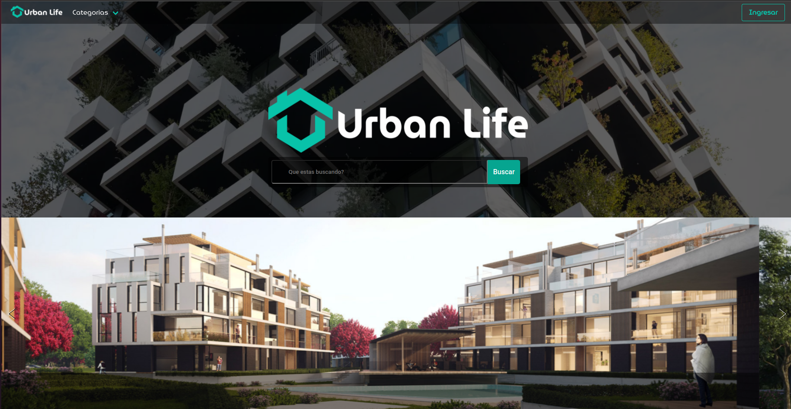
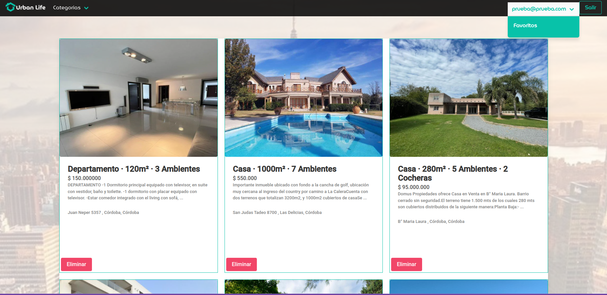

# Instrucciones:
## Objetivo
La idea es construir una app de punta a punta , utilizando el back-end y front-end, con las tecnologías vistas en el bootcamp.

## Metodología First
ÁGIL: Todos los días por el canal de comunicación asignado, comentar a primer hora del día en que estuviste trabajando, con que estas ahora y con que vas a estar próximamente y si algo te esta bloqueando.    
Trello: El primer paso es tomar el trello de ecommerce como referencia, y armar un trello con todos los puntos de este trabajo. Antes de arrancar a codear validarlo con staff.    

## Inicio
Para este trabajo no hay repo, vas a tener que codear todo desde 0. Esa es la idea, entender todo lo que vas haciendo, no quiere decir que de memoria te tengas que acordar de todo, pero si que cada línea la escribas y entiendas lo que estás haciendo. 

La estructura del proyecto queda a tu criterio, recomendamos separar el front y el back en dos carpetas distintas y ahí comprender cada área.

Generalmente es más conveniente arrancar desde el backend hacia el front end.

## Backend
Primeramente vamos a crear una base de datos utilizando Firebase
Desarrollar una API que permita: crear, modificar, borrar y listar todas las propiedades (inmuebles).

Además, se tienen que poder visualizar todas las propiedades, y ordenarlas por categoría.

Las propiedades van a contar con:
- **nombre**: direccion de la propiedad (ej: Castillo 1332)
- **descripcion**: descripción de la propiedad
- **precio**: precio del inmueble
- **ubicacion**: barrio del inmueble
- **imagen**: url de la imagen (solo 1)
- **disponible**: booleano, por default: true

Tambien tiene que tener un getter **truncarDescripcion** que devuelva la descripción truncada a solo 20 caracteres y termine con '…'

Agregar un hook antes de ser creado que se fije en la propiedad 'disponible' en caso de ser false, agregar en el titulo de la propiedad un "NO DISPONIBLE", por ejemplo, si la propiedad "CASA QUINTA 7" no esta disponible quedaría: "CASA QUINTA 7 NO DISPONIBLE"
Optativo: por un setter en "disponibilidad" de forma tal que cada vez que cambia la disponibilidad del producto, el titulo cambie dinámicamente, poniendo y sacando el "NO DISPONIBLE", ya que con el hook solo se haría en la creación!!

Las propiedades pueden tener varias categorías.
Modelo Categoria {
	nombre: string
}

- Desarrollar el registro y logueo de un usuario
- Que podamos agregar una propiedad a favoritos de un usuario
- Que un usuario con Rol "Administrador" pueda dar de alta, baja o modificación de propiedades.

### Front-end
Queremos una lista simple de propiedades con un sidebar a la izquierda para los filtros.

### Interaccion con las propiedades
Al hacer click en un item aparezca un modal con sus datos cargados como input, el modal tiene que tener dos botones, unos para guardar ediciones a la información, otro para borrar el inmueble.
Si queremos agregar una propiedad deberia haber un boton de agregar que abra el mismo modal de edicion pero con los campos vacios.

## Conclusiones
Creo que ya se va entendiendo la idea del trabajo en general, si queda algún punto que no se haya cubierto con las consignas, lo dejamos a su sentido común de usario, hacerlo de una manera adecuada, para lograr una buena experencia en la navegación y proposito de la app.

## Metodo de trabajo
El trabajo es libre siempre y cuando cumpla las indicaciónes. forkeen este repositorio y pusheen una vez tengan el resultado.
Recuerden no trabajar el problema como un todo si no ir avanzando de a poco.

Mucha suerte y no olviden consultarnos cualquier duda.

## Bonus Track
- Que sea responsive

------------

